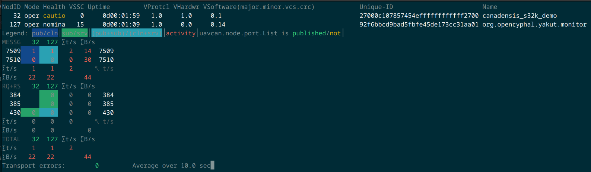

# S32K146 Microcontroller Node Example

This implements a Cyphal node with the basic functionality:
* Publishing heartbeat messages
* Responding to node information requests
* Publishing port list messages

## Required hardware

* An [NXP UCANS32K1SIC](https://www.nxp.com/design/design-center/development-boards-and-designs/UCANS32K1SIC)
  evaluation board
  * A CAN-TERM-BRD, a DCD-LZ board, and a debug cable (included with the UCANS32K1SIC)
  * Two 4-pin CAN and power cables (the UCANS32K1SIC includes only one)
* A debug adapter that supports serial wire debug (SWD)
* A CAN-USB adapter that works with your computer, like a [CANable](https://canable.io/)

## Software

* rustc 1.87 or later
* Pre-compiled `core` for the ARM Cortex-M4F target. The easiest way to install is:
```shell
rustup target add thumbv7em-none-eabihf
```
* Software to work with your debug adapter, at least one of the following:
  * [`probe-rs`](https://probe.rs/): Easiest to use (GDB not required), but has limited S32K1x support
    so it can't recover the microcontroller from a bad state
  * [Black Magic Debug App](https://black-magic.org/): Most of that page is about the adapter hardware, but the
    Debug App runs on a computer like OpenOCD.
  * [OpenOCD](https://openocd.org/): This [got s32k1 support in 2022](https://sourceforge.net/p/openocd/code/ci/a77d280bd07b355b5ec981a91eefa88695081bf1/)
    but version 0.12.0 (the latest release as of this writing) does not support s32k1 microcontrollers.
    Until we get a new release, you'll need to [download the code](https://sourceforge.net/p/openocd/code/ci/master/tree/)
    and compile it to get a version with s32k support.

## Getting started

### Hardware setup

* Connect the 7-pin debug connector on the UCANS32K1SIC board to the DCD-LZ board
* Connect the DCD-LZ board to your debug adapter
* Connect two CAN cables to the 4-pin CAN0 connectors on the UCANS32K1SIC board. These two connectors are on the top
  and bottom of the board, close to the corner.
  * Connect one of the CAN cables to a CAN-USB adapter and a terminating resistor if the adapter does not have one
  * Connect the other CAN cable to a CAN-TERM-BRD board (included with the UCANS32K1SIC)
  * Connect the micro-USB port on the CAN-TERM-BRD board to a USB port or another 5 V power supply
* Connect the debug adapter to your computer

### Compiling

```shell
cargo build --release
```

### Flashing the microcontroller

With probe-rs, simply run
```shell
cargo run --release
```
For OpenOCD or the Black Magic Debug App, you can find the compiled file at `target/thumbv7em-none-eabihf/release/s32k146_node`.

If the code is running correctly, the green LED on the board should blink with a period of one second.

### Interacting with the microcontroller

Set the CAN-USB adapter bit rate to 1 megabit/second.

The microcontroller will use node ID 32.

Use [yakut](https://github.com/openCyphal/yakut) to show information about the node.
The CYPHAL_PATH and CAN interface may need to change depending on your setup.
```shell
export CYPHAL_PATH=~/.cyphal
export UAVCAN__CAN__IFACE=socketcan:can0
export UAVCAN__CAN__MTU=8
export UAVCAN__NODE__ID=127
yakut monitor
```


## Known issues and limitations

The S32K1 series of microcontrollers have almost no support for Rust firmware, so this example is not very elegant.

* Changing the code in some ways, or turning off link-time optimization, may make the microcontroller get stuck in a
  panic handler for unclear reasons. There is probably some small detail about the microcontroller that this software
  does not account for, or the FlexCAN driver could have undefined behavior.
* The hardware and canadensis both support CAN FD, but the FlexCAN driver does not.
* The FlexCAN driver probably has some bugs related to aborting transmissions, remote messages, and transmit priority.
* The FlexCAN driver uses only one of the many message buffers to transmit frames.
* The FlexCAN driver does not support filtering incoming messages.

## Help, I get strange errors when trying to connect a debugger or flash

Many small problems can put the S32K146 microcontroller in a bad state:
* Not disabling the watchdog during startup
* Breaking one of the many subtle rules about clock configuration
* Changing the values in the flash configuration field starting at 0x400

Unless the flash configuration set the microcontroller to secure mode with erasing disabled, this is usually fixable.

Follow these steps to erase all the flash:

1. Start `blackmagic-bmda` (this should print the port number it's listening on)
2. In a separate window, start `gdb` and enter these commands
   1. `target extended-remote :2000` (to connect to blackmagic-bmda)
   2. `monitor swd_scan`
      1. This should show one or two access ports, including "Kinetis Recovery (MDM-AP)"
   3. `attach <n>` where n is the number that corresponds to Kinetis Recovery
   4. `monitor erase_mass`

If that succeeds, `cargo run --release` or another method should be able to flash the microcontroller normally.

If that fails, these steps may help:
* Turn the microcontroller power off and on again
* Connect the reset pin to ground throughout the whole process

[AN12130](https://www.nxp.com/docs/en/application-note/AN12130.pdf) has more details about how that works.

## Other useful links

[UCANS32K1SIC board documentation](https://www.nxp.com/document/guide/getting-started-with-the-ucans32k1sic-evaluation-board:GS-UCANS32K1SIC?section=get-hardware)

[S32K146 microcontroller documentation](https://www.nxp.com/products/S32K1)

[S32K146 example code in C](https://github.com/nxp-auto-support/s32k146_cookbook/tree/master)

[S32K1 svd2rust generated PACs](https://github.com/wcpannell/s32k1-pacs)